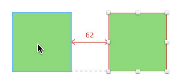
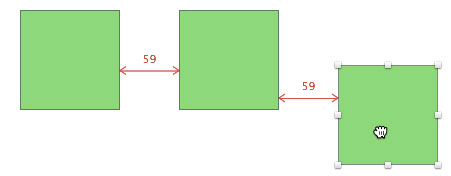

# 画布

Sketch 里的画布尺寸是无限的。你可以用无限精准的分辨率无关模式来查看画布，或者打开像素模式来查看每一个像素导出后的样子。
 
如果你想在画布中设置一个固定的边框，你可以直接用画板 (Artboard) 工具创造一个新的画板。
 
### 导航
 
画布中的导航是非常容易的，你可以直接用鼠标滚轮滑动或者电脑的触摸板来控制方向。你还可以按住空格键，来使用抓手工具移动画布。并且，没有任何对象被选中的时候，你可以用方向键来移动画布。
 
值得注意的是，Page Up/Page Down 是用来在页面当中切换的。
 
### 放大
 
我们有一些列的快捷键来帮助你放大查看画布或对象，你也可以按住 command 键并滚动鼠标滚轮来放大查看。
 
最后，你还能用 Z 键来快速放大某一特定区域，单击画布任一点拖拽出矩形区域即可。

## 像素缩放

在 Sketch 里，你可以用来你两种方式来查看你的作品，具体用哪一种则取决于你的创作了。这两种模式可以在 视图 > 显示/隐藏像素网格 (View > Show/Hide Pixel Grid) 当中切换。值得注意的是，当你用 100% 的尺寸（图片的实际尺寸）来查看时，这个两个模式看起来是没有任何区别的，只有当你放大图片时，才会显示。
 
如果你很在意作品中每一个像素看起来的样子，那么这个像素模式就非常是你的菜。你所看到的就相当于，先把这张图到处为 PNG 格式再在 MAC 自带的“预览”应用中放大查看。
 
如果你不太在意这些那么传统的模式会更适合你，就算你放大，所有的图形也依然会有顺滑的曲线。
 
### 强制像素预览
 
有时你会发现你无法退出像素模式，这是因为有些图层效果（模糊和色彩校正）必需在像素基础上工作。这就意味着，想要展现这些效果，你必须先栅格化图形然后再添加滤镜，也就是说，虽然矢量预览不再适用，但我们可以强制显示像素预览。
 
当你无法退出像素模式时，Sketch 会弹出对话框告诉你具体是哪一个图层在阻止你，如果你正在创作一个非常大的文件，这将会帮你节省不少时间。

## 标尺，参考线，网格

Sketch 里的这几个工具能帮你把图层准确的放在理想的位置，是沿着网格还是沿着一条直线，又或者是在另两个图层正中间。
 
### 参考线
 
自动参考线在 Sketch 的默认设置中是被打开的，你可以同时按住 control 键和 L 键来关闭它。当你在调节一个图层的大小或者移动一个图层的位置时，Sketch 会自动帮你把这个图层与其他图层对齐。如果 Sketch 将某一图层自动与另一图层对齐，你会看见一条红线，两个图层便依据这条红线对齐。
 
### 标尺
 
Sketch 当中的标尺在默认设置中是被隐藏起来的。就像我们说的，Sketch 里的画布是无限的，所以标尺也并不是固定的。你可以任意拖动标尺来设置自己的起始点。
 
你可以在标尺上任一处双击鼠标，便可以添加手动参考线，只要标尺是被显示的，这些手动参考线也会一直被显示。想移动标尺，你需要在标尺里按住鼠标拖拽。想要移动手动参考线，你需要在标尺中选中参考线再拖拽。想要移除手动参考线，则需要把参考线拖出标尺之外，噗的一声便会消失。
 
### 规则网格
 
你可以进入 视图 > 显示网格 (View > Show grid) 来打开网格，在这里你还会看见 网格设置 (Grid Settings)的按钮. Sketch 支持两种不同的网格：规则网格和布局网格，你可以根据所进行的创作来选择适合的网格，这两者的区别也非常显而易见：
 
规则网格可以调节小方块的大小以及粗线条出现的频率，默认的规则网格是由长度为 20px 的小方块组成的，每 10 个小方块出现一条粗线条。
 
### 布局网格
 
在布局网格里，你可以改变页面的总宽度，以及所含多少个纵列。同时你也可以修改每一个横排的高度和纵列的宽度, 同时还有针对空白的选项。
 
Sketch 会尽力将网格放在画布的正中间，不过一旦画布大小发生改变，网格可能就不在正中间了，这时候你只需要按下 “Center” 键就可以让网格对齐到画布中心。

## 测量

Sketch 有一个超棒的内置工具，来确保你创作的内容都能整齐排列。这对与那些收到 Sketch 设计稿的开发人员来说也是个福音，他们可以轻松的查看每个元素之间的精确距离。
 
### 距离
 
当你按住键盘上的 option 键，Sketch 会帮你显示出你已选中的图层和你的鼠标现在所悬浮的图层之间的距离，一个简单的图例便能说明。

同样的，在移动一个对象时，移动到和另外两个对象的距离相等，Sketch 也会给你提示。

同样的，如果你在调节一个图层的大小，Sketch 也会帮你显示出具有相同长度或宽度的图形的数据。

