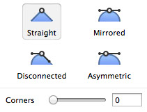

# 图形

在你的文件中最常见的图层应该就是图形了。Sketch 提供了多种不同的基本图形供你选择：圆形，矩形，星型等等。这几个图形中会有几个有趣的额外选项，比如星型和圆角矩形。
 
你只需单击工具栏中的 添加(Insert)>图形(Shape) 按钮，选择一个图形，便可以开始创作。当你的鼠标在画布上拖拽的时候，Sketch 会提示你这个图形的大小，松开鼠标，便会成功添加图形，右边的检查器上也会立即显示出这个图形的相关信息，又是也会出现相应的额外选项。
 
### 额外选项
 
有些图形会带来几个有趣的额外选项，你最经常遇到的便是星型和圆角矩形，你可以调整星型的半径和角的数量，也可以改变圆角矩形的圆角半径。
 
### 图形术语
 
点是组成每一个图形的基本单位，他们会被直线或曲线连接成一条路径。一个图形可以包含一个或多个路径。多个路径则是通过布尔运算组合在一起的，想象大小两个圆，小圆被放置在大圆上把大圆“打”出一个洞。这个将简单图形组合成复杂图形的布尔运算我们会在另一章节详细讨论。

## 图形编辑

每当你绘制一个新的图形或是编辑一个现有的图形，你其实都是在和点做交互，你在屏幕上看到的是 Sketch 将这些点连接起来的线。有时是直线，有时是曲线。
 
举个例子，先通过工具栏的 添加 > 图形 > 矩形 （Insert > Shape > Rectangle）来添加一个矩形，完成后再双击它开始编辑，你会看见每个角上都会有一个小圆点，你可以单击并拖拽这些点来移动。需单击图形边上任意点单击就可以添加新的点，要想删去某一个点，只需选中它，然后按 delete 健。
 
如果你想将一条直线变为曲线，先双击一个点，它的两侧会出现两个新的小手柄，他们分别控制这这一点两边线条的弯曲程度。你可以把这些小手柄理解为他们把线条朝自己的方向拉伸。

### 点模式
 
点的控制手柄有几种不同的模式，他们决定了之间会出现怎样的线条。
 
在编辑图形的时候，检查器会显示出四种不用的点模式：
 
- 直线角 (Straight)：当你刚刚点击画布的时候，会添加一个直角，也就是说没有任何锚点，你所得到的便是一条直线。
- 镜像 (Mirrored)：锚点会镜像对应。两个锚点将会与主点距离相同并且正好相互对立。当主点并非直角时，镜像便是默认的点模式。
- 不对称 (Asymmetric)：两个锚点到主点之间的距离是独立的，但他们依然相互对应。
- 断开连接 (Disconnected)：锚点之间完全独立，互不影响。

如果一个角被设定为直线角，你也可以用底下的滑块将直线叫变为圆角。如果你通过 添加 > 图形 > 圆角矩形（Insert > Shape > Rounded）添加了一个圆角矩形，那么你将得到一个四角被设定了默认值的圆角矩形。
 
能够独立控制每个点，代表着你可以为每个点都设置不同的值，比如说你可以轻松的让一个矩形的上面两个点为圆角，底部两个点为直线角。

### 绘制 VS 编辑
 
除了用一个现有的图形工具来添加图形，你也可以用矢量工具自己绘制一个。进入菜单栏 > 添加 > 矢量工具 （Insert > Vector），在画布上单击添加第一个锚点，继续单击别处添加第二个锚点。
 
你会看见有线条连接两点，接着单击别处但不要松鼠标，拖拽锚点以绘制曲线。你可以继续画上几条线，最后单击第一个锚点，便能绘制出一个封闭的矢量图形，完成编辑。
 
不管是绘制新的图形还是编辑现有的图形，选择和添加新的锚点的这些操作方法都是一样的。

### 封闭路径 VS 开放路径
 
一个路径可以是封闭的也可以是开放的。封闭图形的最后一条边会与第一条相连接，开放图形则会在起点和终点间留出一个间隔。你可以通过菜单栏中的 图层 > 路径 > 关闭路径 （Layer > Paths > Close Path），来将一个开放路径变为封闭路径，反之亦然。
 
针对一个开放路径，你可以随时在编辑模式中随时添加新的锚点。
 
值得注意的是，当你为一个开放路径设置了颜色填充，那么这个填充会呈现出路径已经被封闭了一样，哪怕这个路径的边框仍然有间隔不完整。

### 快捷键
 
绘制矢量图形时，你可以按住 shift 键再画之后的点，Sketch会自动帮你对齐到前一点的45度角方向，这在你绘制直线时会非常方便。如果你是在两点之间添加新的锚点时按住 shift 键，你便会得到两点间的锚点。
 
如果你按住 command 键，单击两点间的线条，Sketch则会帮你在线条的正中间添加锚点。

### 选中多个点
 
有一个不那么明显的功能是你可以同时选中多个点，一起移动它们。在选择点的时候按住 shift 键就好，你会看见被选中的点中心是白色的，而没被选中的点中心是灰色的。
 
另从画布空白处单击并拖拽出一个矩形选区。如果你一直按住了 shift 键，则会将新选区和之前的点一起选中，如果没有按住 shift 键，则会取消之前的选择，只保留新选区内的点。

## 布尔运算

如果 Sketch 的标准图形中没有你想要的图形，那就需要你自己创作了。你的第一个想法也许是用矢量工具来手绘出来，然而你会发现很多复杂的图形都可以轻易地被拆分成基本的图形，布尔运算正是为了帮你实现这一点——将几个基本图形结合成一个复杂图形。
 
### 子路径
 
Sketch 支持动态的布尔运算，但在我们做进一步讨论之前，先来快速的回顾一下矢量图形。Sketch当中的大多数矢量图形都只含有一系列的锚点——也就是说都只有一个路径。然而一个图形可以有多个子路径，至于这些子路径最终是什么效果，则取决于他们是如何组合的。
 
在 Sketch 当中使用布尔运算，Sketch 会通过具体的布尔算法将最上层的图形变成下一层图形的子路径。因为 Sketch 当中的布尔运算是动态的，所以你也可以随时调整每一个子路径，比如你可以单独调整其中一个矩形的内角半径。

### 布尔运算
 
我们有 4 种不同的布尔运算，你可以根据需要来具体选择：

- 合并形状 (Union)：合并的结果是会得到两个矢量区域的总和。
- 减去顶层形状 (Subtract)：这一项的结果是顶层矢量的区域会从下一层的图形上移去。
- 与形状区域相交 (Intersect)：与形状区域相交的结果是会保留原图形重叠的部分。
- 排除重叠形状 (Difference)：排除重叠形状的结果是只保留原图形不重叠的部分，它是“与形状区域相交”这一运算的反向。

### 图层列表
 
当你有一个含有多个子路径的图形时，你可以来看看左侧的图层列表。正如编组列表一样，图层列表的左边也有一个下拉箭头，单击它你便会看见这个图形的子路径列表。值得注意的是，每一个子路径的布尔运算你都可以在右边的按钮中单独修改。一个子路径可以被设置成减去顶层形状，它上面的一个子路径则可以和它再相合并。
 
图层列表的顺序是从下至上的，布尔运算的工作原理也是一样，即你所选的布尔运算将这一层和下一层的图形相组合，他们的结果再与另一层相组合。

### 图层扁平化
 
当你使用扁平化功能（ Flattening），Sketch 会试着将一个图形里的多个子路径呈现为一个路径——也就是将层级结构变得更扁平。但是有些图形是无法扁平为一个路径的，比如说一个环状图形，将只能被呈现为两个路径：一个是外圈路径，一个是内圈路径。
 
当 Sketch 不能完成扁平化的命令时，会出现一个小警告，如果你继续坚持，那有的子路径可能被替换，也许比之前跟少，也许和之前一样多。
 
也许在你之前使用的绘图应用中，你每次添加布尔运算后到要让图层扁平一次，但在 Sketch 当中大可不必这么做，你可以尽情添加无数曾布尔运算，而无需使用扁平命令。

## 变形工具

变形工具可以通过改变点的位置或者制造一个视觉上的 3D 效果来使一个矢量图形变形。Sketch 里，你可以运用变形工具变形一个或同时变形多个图层。
 
选中一个或多个图层，然后单击工具栏里的变形工具。你可以拖动四角的锚点来任意改变图形的形状，或者拖拽中间的锚点来同时移动两个边角使图形倾斜。
 
当你从一个图形的一角拖拽变形，你会发现其对角也会往相反方向拉伸，这能形成对称的变形效果，但如果你只想往一个方向拉伸，按住 command 键再拖动鼠标就好。

## 蒙版

Sketch 里的蒙版可以让你有选择性的显示出图层的一部分。比如说在一个图片上圆形蒙版，那么这张图片就只会显示出圆形内部的内容。
 
所有的图形都可以变成蒙版，你只需要先选中图形，然后进入 图层 > 使用图形蒙版(Layer > Use as Mask), 所有在这个蒙版上面的图形都会被剪切成蒙版的内容显示出来。

### 限制蒙版
 
如果你不想接下来所有的图层都被蒙版剪切，那么你可以将蒙版和想要被剪切的图层单独编组，一次来限制蒙版的使用情景。一旦蒙版被编组，其他一切在组外的图层就都不会被蒙版剪切了。
 
在无法编组的情况下，你还可以通过以下方式限制蒙版：
 
- 选中一个你想从剪切蒙版中释放出来的图层
- 进入 图层 > 忽略底层蒙版 (Layer > Ignore Underlying Mask)
 
这一层图层和它以上的所有图层就都不会被蒙版剪切了。当你调整图层顺序的时候则需要格外注意，个别图层可能会意外的被蒙版剪切。
 
### 图形蒙版
 
如果上面这一系列操作听起来很麻烦，我们也有更好的办法：在画布上同时选中一个图形和一张图片，选择 图层 > 用所选图形做为蒙版 (Layer > "Mask with Selected Shape")， 就可以直接将这个图形作为选中图片的蒙版了。Sketch 会自动为他们编组，并把其中的图形图层变成蒙版。

### ALPHA 蒙版
 
默认情况下，一个蒙版会显示出所在区域的图片，隐藏其他的地方。另一种使用蒙版的方式是通过 ALPHA 蒙版建立渐变区域，来具体选择图片的各部分是否可见。
 
使用这个方法你可以先选中蒙版，选择 图层 (Layer) > 蒙版模式 (Mask Mode) > ALPHA 蒙版 (ALPHA Mask) 来实现。

## 剪刀工具

剪刀工具可以用来剪去矢量图形的线条。你可以先选中矢量图形，然后选中工具栏中的剪刀工具，或者在菜单栏中进入 图层 > 路径 > 剪刀工具 (Layer > Paths > Scissors) 来使用。
 
接下来你可以单击矢量图形的边来剪切它。当你完成后，只需单击图形外的画布，或者按下键盘上的回车键或退出键即可。当你将图形剪切到只剩一条直线时，Sketch 会自动退出剪刀工具。

## 复制旋转

这是 Sketch 当中一个特别的工具。它并没有出现在默认的工具栏里，但你可以通过右击工具栏并选中定制工具栏 (Customize)来将旋转复制添加到工具栏上。你也可以在菜单栏中进入 图层 > 路径 > 复制旋转 (Layer > Paths > Rotate Copies).
 
这个工具能复制选中的图形，并按照一个特定的中心点旋转。例如绘制一朵花，你可以先画出一片花瓣，然后复制12片花瓣并旋转，即可得到一朵花的图案。
 
你可以选中一个图层，激活复制旋转工具，输入你想要的复制数量，接着调整中心点的位置，最后单击图形外的画布即可退出复制旋转工具。

### 分离路径
 
所有的复制图形都会被视为原图形的子路径，如果你想让他们成为完全独立的图层，你只需从菜单栏进入 编辑 > 路径 > 分离 (Layer > Paths > Split)即可。

## 铅笔

你可以使用铅笔工具来自由的绘图。当你松开鼠标之后，Sketch 会帮你简化路径，顺滑曲线。
 
你可以在工具栏的添加菜单中找到铅笔，也可以用铅笔的快捷键 P。

## 描边宽度

描边宽度工具让你任意改变图形边框的宽度。选中一个矢量，在检查器中设定边框，然后在菜单栏中进入 图层 > 路径 > 描边宽度 (Layer > Paths > Stroke width)。现在再点击画布上的图形边框，添加一个宽度锚点，你可以拖拽这个锚点使描边变宽或变窄。

