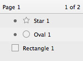

# 界面

我们将 Sketch 的界面设计的非常简洁。最顶端的工具箱包含了最重要的操作。你可以用右侧的检查器来调整被选中图层的内容，左侧的窗口则会列出文件中的所有图层，中间当然就是你正在创作的画布。
 
Sketch 里没有浮动面板，检查器将会根据你选中的工具来显示所需控件，这样你能始终不受打扰的在画布上创作。

## 画布

Sketch 的画布尺寸是无限的，可以向任意方向无限延伸，你将拥有绝对的自由来规划自己的创作区域。
 
如果你想在画布中设置一个固定的画框，你只需新建一个或多个新的画板。举个例子，设计移动应用界面时，很多设计师会为应用的每一个屏都创建一个画板，然后排列开来以便查看。
 
你可以用无限精准的分辨率无关模式来查看画布，或者打开像素模式来查看每一个像素导出成JPG或者PNG文件后的样子。值得注意的是，有些效果——比如模糊——会自动将画布的一部分以像素模式显示，因为模糊本身就是一个基于像素的效果。

## 检查器

右侧的检查器能让你对正在编辑的图层——有时是正在使用的工具——进行参数调整。当你选中一个图层时，你会发现检查器被划分为几个区域。

### 通用属性
 
通用图层式样都在顶端区域：图层所在位置，透明度，混合模式以及几个特殊选项——比如调整矩形内角半径和多边形的不同点模式。

### 样式属性

边框和填充属性都有他们独自的区域，你可以勾选左上方的小方框展开他们，并显示出具体的选项。如果你点击颜色按钮，你会发现检查器滑倒一边，出现新的专门的颜色检查器，你只需要单击顶端的“后退”按钮便会回到主检查器。当你选中了其他图层，同样会自动回到主检查器。

## 图层列表

图层列表列出了所在页面的所有图层(和切片)，每个涂层都会有一个小小的预览。你可以在这里：查看涂层是否被锁定，不可见，使用了蒙板或标记为可导出；重新排列图层，或者给图层添加布尔运算，比如减去顶层形状；对图层进行建组或者重命名来管理他们。
 
### 多页面操作
 
Sketch支持多页面操作，你可以在图层列表上面的按钮里面添加/删除或者转换到其他页面（或者用键盘上的 Page Up/Page Down来切换）。图层列表始终只会显示当前页面的图层。

 
### 画板
 
在图层列表里，有白色背景一栏的便是画板，你可以把画板视为设计中的顶层对象，所以一个画板不能被嵌入另一个画板。

### 蒙版
 
在图层列表里，那些使用了蒙版的图层名前会有一个小点，它的蒙版则是底下紧接着不带小点的图层。了解更多关于蒙版。

### 布尔运算
 
每个图形都可以包含多个子路径，他们会以组的形式呈现在图层列表中，伴随一个下拉箭头显示具体的子路径。每一层子路径都可以单独设置布尔运算，决定和它的下一图层以什么方式组合。图层列表能清晰的展现子路径的组合方式，同时方便你随时调整更改。

### 符号和共享式样
 
符号是一种特殊的组，他们可以出现在文件的多个地方。符号会以紫色文件夹图标呈现在涂层列表中——正常编组则是蓝色的文件夹。了解更多关于符号。
 
共享式样可以使多个对象（图形以及文本）的式样保持一致，如果一个图形或者一段文本使用了共享式样，他们的预览小图标会显示成紫色，而不是标准的灰色。了解更多关于共享式样。

## 工具栏

Sketch 的工具栏涵盖了你创作当中所需要的所有工具。
 
在默认工具栏中，第一组工具是用来添加新图层的：图形、图片、符号等等。
 
编组 (Group) 和取消编组 (Ungroup) 能让你有条例的组织文件。
 
接下来的几个工具则都是用来编辑现有图层：旋转 (Rotate)，变形 (Transform)， 通过布尔运算来合并图层，以及在图层列表中上移或下移图层。
 
工具栏最后的导出(Export) 按钮 同时也是一个切片工具，你可以在这将你的作品导出为一个或多个位图或者矢量文件。
 
不同于其他绘图应用，Sketch把常用工具放在顶端的工具栏，而不是垂直排列的工具箱，但如果需要，你可以通过右击工具栏，进入“定制工具栏…” (Customize toolbar…) 来添加工具和快捷键。