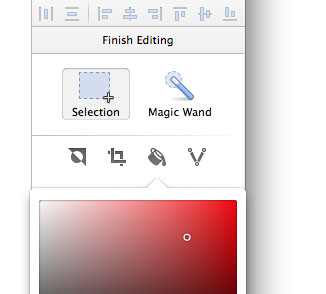
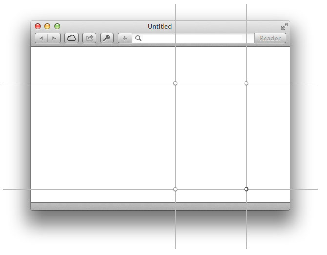
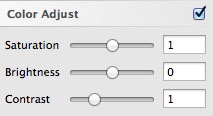

# 图片

Sketch 不是一个位图编辑器，所以我们的图片编辑功能比较有限。但是 Sketch 3 改进了这一点，现在能更好的处理文件中的图片。
 
值得注意的是，你可以将任何图层变成一个扁平的位图，通过进入 图层 > 将选区变成位图 （Layer > Flatten Selection to Bitmap）。

## 位图编辑
 
Sketch 中的位图编辑有很大的提升，现在也有一个得体的 UI 来专门展示。
 
选中一个图片，双击它进入编辑模式，你会看见检查器里出现了几个特殊的工具，但是你需要先在画布上设立一个选区，然后再选择编辑工具。
 
- 选区：在图片上选择一个矩形区域
- 魔棒：单击画布上任一点开始拖拽以选择一个区域，拖拽的范围越大，容差就会越大。
 

值得注意的是，你可以按住 shift 来同时添加多个选区，或者按住 option 键从已有选区中取差集。一旦确立好选区，你可以剪切/复制选区来创建一个新的位图，或者用以下四种工具再来编辑。
 
- 反向：当前未被选中的区域会被选中，反之亦然。
- 剪裁：剪去选区之外的区域。
- 填色：为选区填充特定颜色。会出现拾色器供你选择颜色。
- 矢量化：将选区转变为的图形图层，与魔棒工具结合能发挥强大功能。
 
当你结束对位图的编辑，只需单击图片外任一点，或按下 return 键/ escape 键即可退出编辑模式。

## 九宫格

正常情况下，你缩放一个位图时，他们会对称的向各个方向变化。但有时这并不是你想要的，比如说你在做一个网页设计，你也许会想要一个 safari 里的白色背景，随着网页内容变多而变长。
 
我们特意增加了针对图片的九宫格缩放来解决这个问题。进入 图层 > 转化为九宫格图片 （Layer > Convert to Nine-slice Image），你会发现图片被划分为了9个区域。你可以单击拖拽四个中心点的任一个来调整9个区域。

下次你再缩放这个图片时，变只会向某一个方向移动和伸展，并按比例的缩放中心的部分。

## 色彩校正

如果你想微调一张现有图片的颜色，那可以使用检查器中的色彩校正面板来实现，在这，你可以改变图片的饱和度，亮度和对比色。
 
需要注意的是，这一个不破坏原图的操作，所以你稍后还可以再次更改这些参数。

