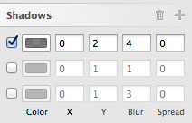
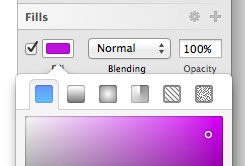
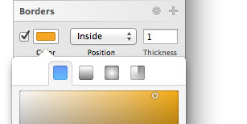
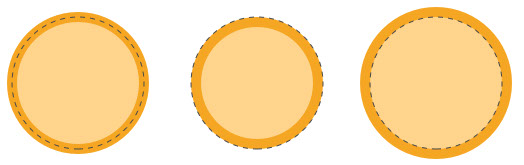
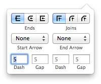

# 式样

检查器会显示出所选图层的一切式样选项。
 
从共享式样开始，接着是通用透明度、通用混合模式，再下面是填充、边框、阴影、模糊和镜像，我们会在本手册中分章节一一介绍，但是现在我们想先讨论几个通用的小技巧。

### 输入框
 
我们有一个很特别的输入框，鼠标悬停上去时你会看见上下两个小剪头出现在文本区域右边，你可以单击他们来增减图形的大小。如果你按住 shift 则会以 10 为单位变化。如果你按住 option 键，则会以 0.1 为单位变化。

### 上下箭头
 
一旦你开始直接编辑输入框，上下剪头就会消失，但这个功能依然可用，你可以用键盘上的上下方向键配合 shift 或 option 键来完成。

### 运算
 
输入框另一个很棒的功能是可运算，简单的入 +5 或 /2 这样的四则运算都没有问题，不同的运算符号也是支持的。
 
### 模糊值
 
调整文本框大小更快的方式是直接拖拽文本框底部的手柄。如果你已经很确定理想的文本框大小，只是想看看在画布上的效果，这能帮你做最快的测试。

### 返回画布
 
你将会在画布和检查器中来回操作，先在画布上选中一个对象，去检查器修改一些数值，然后再回到画布。然而正常情况下应用仍会关注在检查器上，所以如果你想按 R 键来快速新建一个矩形，结果会是你在检查器的输入框中输入了 R 。
 
绝大多数时候这都不会是你想要的，所以先按 return 键来确认输入框中的任何编辑。然后再按一次 return 键，即可返回到画布中，并可以使用任何其他画布专用的快捷键了。
 
### 拖放
 
任一边框、填充或是阴影都可以被拖拽，只需在按钮和输入框的中间地单击开始拖拽即可。你可以通过这个方式来重新排列填充层，或是直接拖出检查器已删除某一填充。

### 删去无用式样
 
一个高效尝试不同式样的方法是添加多个边框和阴影，然后选择性的打开或关闭一部分。也许是这个原因，我们发现很多设计师的检查器里都有好几个无用的式样。
 
为了让删去无用式样更方便，我们增添了一个小垃圾桶图标，一旦检查器中出现无用的式样，这个垃圾桶就会显示出来，单击就可以删去所有的无用式样。

### 复制粘贴式样
 
这并不是和检查其完全相关的内容，但你也可以使用编辑菜单，来在不同图层之间复制粘贴式样。如果你不想图层始终保持链接，但又想共享其中一部分元素，这便是最好的选择。

### 对齐
 
检查器的最顶端是一些关于对齐的按钮。右边的 6 个按钮是让多个图层相对自身对齐，只有一个图层的情况下则是与当前的画板对齐。
 
左边的对齐按钮则是让图层垂直或水平分布，比如说水平分布，最左和最右的两个图层会留在原地，其他图层则会均匀的分布在他们中间。

### 图层透明度快捷键
 
同样不是严格和检查器相关的功能，但每当你选中一个图层，你都可以按 1-9 的数字快捷键来快速将图层透明度从 10% 调至 90%，按下 0 则会将透明度调至 100%。

## 填充

Sketch 里你可以为图形填充纯色、渐变、图片（或图案）以及杂色。

填充选项从左至右分别是：

- 纯色
- 线性渐变
- 径向渐变
- 环形渐变
- 图案填充
- 杂色填充

### 添加填充
 
你可以单击第一个色彩填充旁边的 + 按钮来添加新的填充，每一个图层都可以有无限的填充，填充会按照从下至上的顺序叠加，每一层填充也都有自己可调节的混合模式和透明度。

### 图案填充
 
你也可以在预设中选择图案来进行图案填充，或者你也可以自己添加一张图片，平铺 (Tile) 或者扩展 (Fill) 的来填充。
 
- 平铺:图像被不断重复直至铺满整个区域
- 扩展 :图像被放大直至占满整个区域

### 杂色填充
 
杂色填充能为你的图层增添细小纹理，让乏味的填充和图形变得更生动独特。
 
Sketch 3 现在包含了黑色、白色和彩色三种不同的杂色图片，你还可以分别给他们设定混合模式。

## 边框

除了文本之外的所有图层都可以有多个边框，你也可以给边框设定不同的粗细、颜色和混合模式。
 
边框选项从左至右分别是：

- 纯色填充
- 线性渐变
- 径向渐变
- 环形渐变

### 边框位置
 
边框可以出现在一个路径的中间，内部或外部，如果你有一个封闭的图形，那么内边框会被绘制在图形的轮廓以内，外边框则会在轮廓以外。
 
中心边框则会刚好绘制在轮廓线上，一个开放图形只能运用中心边框，一条直线也只能运用中心边框，毕竟直线根本就不存在“内外”的概念。

### 纯色或渐变
 
一个边框可以运用纯色或渐变色来填充，你可以在每个边框的色彩检查器里更改，比如从一个扁平颜色换成一个渐变的绿色。
 
编辑一个边框渐变色和编辑填充渐变色是一样的操作方法，你可以在渐变的章节了解更多。

### 虚线
 
矢量图层会有几个额外的边框选项：虚线，更改结束点或合并点的图形。想创作虚线，你可以先找到检查器中的边框区域 (Border)，单击右上角的三角形图标，这时边框面板会自动扩展出现几个新的选项，其中最下面就有四个设置虚线的输入框。
 
举个例子，一个4-2的虚线图形会画出一个长4个像素的线条，留出长2个像素的间隔，接着再画4个像素长的线条并一只重复。一个5-4-3-2的虚线图形则会画出一个长5个像素的线条，留出长4个像素的间隔，接着再画3个像素长的线条，留出一个长2个像素的间隔，并重头再来一遍。

## 阴影

阴影和内阴影会有相同的参数设置和工作原理，唯一的区别是阴影一个在图形外部一个在图形内部。每个阴影都可以有自己的混合模式，你可以在颜色弹出窗口里调试。每个阴影同时还有一个扩散值，它会增强对象的阴影效果。
 
值得注意的是，当模糊半径被设置为 0 的时候，文本图层的内阴影才是最好看的。扩散并不适用于文本图层。

## 模糊

Sketch 为你提供了四种不同的模糊方式，你可以在模糊工具的区域中进行选择：
 
- 高斯模糊（Gaussian Blur）：能让你的图层均匀的模糊
- 动态模糊 (Motion Blur)：仅向一个方向模糊，造成一种运动的错觉
- 缩放模糊 (Zoom Blur) ：从一个特定的点向外模糊
- 背景模糊 (Background Blur) ：将图层下一层的内容模糊
 
背景模糊
 
其他几种模糊方式大家都很容易理解，背景模糊则可能需要一点解释。
 
背景模糊是在苹果发布 iOS 7 之后添加的功能，你需要确认有一个半透明的图层在表面应用了背景模糊，这样下层的内容才会出现模糊效果。
 
需要注意的是，模糊是一种非常消耗资源的渲染效果，图层越大，模糊就需要占用更多的内存空间和处理器能力。尽量少使用模糊，如果你一定要在背景模糊和普通模糊中选择，那么选择普通模糊吧。

## 色彩

Sketch 里我们直接将拾色器放在了检查器当中。你可以选中一个图形，进入填充或者边框选择的面板，再点击色彩按钮，这时，通用检查器将会滑到一边，展现出一个新的色彩面板。色彩面板会根据你要编辑的颜色类型（阴影颜色还是填充颜色，纯色还是渐变色）显示不同的选项，但是你会发现色彩面板很大空间都被拾色器占据着。
 
拾色器是基于 HSB 的色彩模式的 r，色彩的饱和度和亮度分别按照水平和垂直方向变化。底下则有两个滑动条，分别供你调整色相和透明度。
 
你可以用色彩值输入框来改变颜色，也可以直接拖拽拾色器里的小指示符。调整色彩的饱和度和亮度时，你可以按住 shift 键来限制只朝一个轴移动。

### HSL 色彩模式
 
紧接着你会看见一个十六进制表示 (HEX) 的色彩数值，以及 RGB 模式的色彩值。你也可以直接单击 RGB 的标签来切换至 HSBA 的色彩模式。

### 常用颜色
 
拾色器下面你会看见一排预设的颜色，这是 Sketch 自动抓取的颜色，它会自动分析你的文件，提取你用到最多的颜色在在这里。这样你就能方便的重复使用颜色，而无需手动的给每个颜色添加预设了。

## 渐变

想要给图形设置渐变填充，你可以直接选中图形，单击填充按钮，色彩工具就会显示在检查器中。想了解色彩工具的使用方式，请先阅读色彩工具章节。在色彩面板的底部，你也可以选择填充纯色、渐变、图案还是杂色。
 
你可以选择线性渐变，径向渐变或是环形渐变，但是他们在 Sketch 中的工作原理都大致相同。
 
如果你选择了线性渐变，你会看见图层上出现了有两个或多个点组成的渐变线，上面每一个点都是一个色彩滑块，滑块之间的颜色则会被绘制成平滑的色彩过渡。想要改变色彩滑块的颜色，你可以先单击选中它，这时你会在右边的拾色器里看见你所选滑块的颜色。只要选择一个新的色彩值，你就能在画布上看到相应的改变。
 
在渐变线中间单击，你就会看见一个新的色彩滑块被添加。你可以移动这些色彩模块来调整渐变过程的平滑度，你也可以移动渐变线的起点和终点来改变渐变的方向。
 
如果你想移除色彩滑块，直接在画布上选中它，再按下键盘上的 delete 键，或是 backspace 键即可。
 
### 径向渐变
 
如果你选中了径向渐变，那么渐变线上的第一个点便会是径向渐变的中心，末端的点则会决定渐变的范围。在渐变色的外圈上，你会发现另一的点，你可以拖拽它使渐变范围在正圆和椭圆当中变化。 
 
### 环形渐变
 
环形渐变会在图层上以中心点顺时针渐变。你可以在其中任意加减色彩滑块，方法和线性渐变一样，在渐变线上移动或者拖拽色彩滑块即可。
 
### 渐变条
 
Sketch 3 里我们添加了一个新的传统样子的渐变条，你能看见渐变的每一个节点，以及从左至右的变化，
 
### 快捷键
 
Sketch 3 里我们也添加了几个快速放置节点的快捷键，你可以按下1-9的数字键来在渐变线的 10%-90% 的位置添加新的节点，所以如果按下 5，就能将节点添加在正中间。如果你想在两个节点的正中间添加，则按下 = 键即可。
 
你还可以使用 tab 键快速的在不同节点中切换，用方向键（也可以同时按住 shift 键）移动节点，
 
### 边框渐变
 
Sketch 里，我们同样可以对描边进行渐变渲染，使用方法和填充渐变类似，只需点击边框面板里的色彩按钮，再重复以上的操作就好。

## 镜像

镜像会给你一个图层是站在玻璃桌面上的感觉。你可以使用滑块来调整镜像的强度。第二个滑块则会决定镜像和原图形之间的距离。如果你认为滑块无法提供足够的灵活性，你也可以在一旁的文本框中输入更大的数值。
 
需要注意的是，使用镜像效果会让这个对象被绘制两次，其中会包含一些性能含义。

## 共享式样

Sketch 2 中就有了共享式样的功能，但是在 sketch 3 里得到了全面的提升。共享式样现在在通用图层选项和式样选项中间的白色区域里。
 
你可以先选中一个图形，然后在下拉面板中设置想要的式样。你可以创建无数的式样，也可以在现有的式样中更换。在共享图层中任一个做修改，其他的都会立即做出相应的改变。