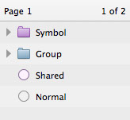

# 符号

符号是 Sketch 3 里一个重要的新功能，它让你方便的在多个页面和画板中重复运用某组内容。但他们保存在某一文件中，并不能在不同文件中共享。
 
符号本身其实就是一种特殊的组，在图层列表中也是以组的形式出现，但是不同于普通的组的蓝色图标，符号会有一个紫色的文件夹图标。

## 创建符号

要想创建新的符号，只需选中一个组，或者几个图层，然后单击工具栏中的 “转化为符号（Convert to Symbol）按钮”。或者进入菜单的 图层 > 创建符号 （Layer > Create Symbol）。
 
如果你所选是多个图层，Sketch 会帮你把他们先进行编组，你会发现涂层列表里这个组的图标变成了紫色，你可以给这个符号重命名。
 
现在你可以再进入 添加 > 符号 （Insert > Symbol），在画布中复用这个符号了。你可以继续复制粘贴这个符号，Sketch 会自动将所有副本保持链接。
 
任何针对某一副本的编辑，都会立即同步到其他所有的副本上去。

### 排除文本
 
符号被运用的最广泛的地方，一般就是网页的 header 和 footer，或是按钮这样的基本 UI 元素。这个时候你就会希望 symbol 当中保持文本的独立：比如每个按钮看起来是一样的，但里面的文本内容各不相同。
 
实现这一点非常简单，你只需先选中符号中的文本，然后勾选 从符号中排除文本（Exclude Text Value from Symbol），这时起，所有针对文本的编辑就都是独立的了。

            

## 管理符号
 
如果你在文件中创建了多个符号不方便管理，你会想把它们也编组。
 
如果你进入 添加 > 符号 > 管理符号 （Insert > Symbol > Manage Symbols），你会得到一个文件中所有符号的下拉列表，你可以在这删除或重命名符号。如果你在符号名中加入了斜杠 “ / ”，Sketch 会将它视为组的分隔标志。举个例子，两个分别名为 Button/Normal 和 Button/Pressed 的符号会被一起编入叫 Button 的组内。
 
值得注意的是，符号始终会按照字母顺序排列，而不是创建时间。

## 复制符号
 
如果你想复制一个现有的符号，选中画布上的任一副本，然后再检查器中选择 复制符号（Duplicate Symbol）。
 
## 交换符号
 
你可以给现有的副本更换符号，比如说，你可以将正常按钮和按下的按钮符号对调，但仍然保持他们的文本不变——如果你之前设定好符号排除文本的话。