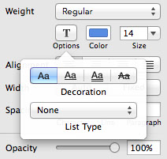
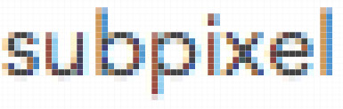
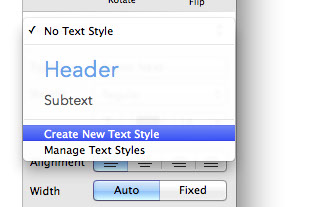

# 文本

Sketch 使用操作系统原生的字体渲染，因此文本看起来都会很棒。使用原生字体渲染的好处就是当你进行网页设计时，你可以肯定作品中的文本都是精准的。Sketch 同时支持文本样式，所以你可以让多个文本图层使用共同的字体，大小，和字间距等等。
 
### 添加文本
 
你可以从工具栏中选择文本工具。当光标变成文本光标时，在画布中任一点单击以添加文本图层。你会看见新的文本图层已被选定，直接开始打字吧。
 
你也可以单击并拖动鼠标以创造一个固定尺寸的文本框，当文本内容大于文本框时，会自动向下扩展文本框长度。而普通的不固定尺寸的文本框则会向后扩展宽度以适应文本内容。

### 改变文本大小
 
如果你直接拖拽文本框，文字本身的大小并不会相应改变，但是你可以拉动文本框底部的缩放手柄来一起控制文本框和文字的大小。

## 文本检查器

当你选中了一段文本，你会发现检查器随之变成了编辑文本所需要的属性。
 
在基本的图层属性下面是共享文本式样的区域。
 
接着是选择字体和字号的地方，同时你可以展开 T 按钮，来选择一些文字装饰，比如下划线。再下面则可以选择字间距，行间距和段落间距。

### 文本颜色
 
编辑文本时，你可以通过 T 按钮和字号中间的颜色按钮为文本设置单独的颜色。你也可以为文本设置一个通用的填充式样，比如渐变，但是任何填充都将针对整个文本图层，这将覆盖刚才那个颜色按钮的设置。
 
值得注意的是，为了在文本上渲染渐变效果，我们得将文本转化为矢量图形，并失去文本的子像素抗锯齿效果。

### 自动大小文本框 VS 固定大小文本框
 
文本框的宽度属性（在对齐功能的下面）可以被设置为自动或者固定。自动大小文本框意味着它会自动扩展以容纳你输入的一切文本。固定大小文本框则会在你输入更多内容时保持现有宽度不变，而增加文本框的长度。

## 文本渲染

Sketch 使用操作系统原生的字体渲染，因此文本看起来都会很棒。使用原生字体渲染的好处就是当你进行网页设计时，你可以肯定作品中的文本都是精准的。
 
Mac OS 系统使用了一种叫子像素抗锯齿效果 （subpixel-antialiasing）的技术来提升文本渲染效果，Sketch 里也是采用的这一种。但有时会出现一些问题警告，我们从一些底层技术来慢慢解释。

### 子像素抗锯齿技术
 
一个电脑的显示器是由网格状的像素组成的。文字渲染遇到的问题是普通的屏幕里并没有足够多的像素来精确的展现文字的曲线。这就需要用到子像素抗锯齿技术了，它会将那些被文字曲线遮住一部分的像素稍稍变亮一些，并且在视觉上产生更平滑的效果。
 
这就是为什么当你在像素模式中把文本放很大观察时，你会看见文字旁边有一些蓝色和棕色的小色块，但是在正常大小时，这些文字效果又没有任何问题。Windows 用户对这种子像素抗锯齿技术不太习惯，他们总是将 Mac 的文字渲染形容成 “很胖”。

### 无法实现抗锯齿时
 
顺利实现子像素抗锯齿效果，文本必需出现在一个不透明的（有色的）背景上，因为系统需要知道最终的颜色对比结果是什么样的。这一点与图层混合模式是相冲突的。
 
要实现图层混合模式，Sketch 需要在一个透明背景上渲染所有的图层，这样这些图层才能像你所期望的那样混合在一起，最终结果再渲染回 Sketch 的白色画布上。
 
这就会带给我们一个问题，如果没有一个不透明背景我们就不能渲染抗锯齿的文字，但是有了不透明的背景我们又不能渲染图层的混合模式了。这就意味着，一旦你的画布中出现了一个有混合模式的图层，Sketch 就不得不运用透明背景的算法，而无法给文字实现子像素抗锯齿效果了。
 
你可以尝试对比一下，将一段文本放在不透明背景上（比如填充颜色或者填充了图片的图形）来看看效果。

### 导出
 
另一个关于子像素抗锯齿效果的问题出现在导出上。在画布上，Sketch 可以顺利的渲染有色背景上的文本。但当你将文本导出为 PNG 文件，并保持背景透明，你便会发现文本变得不太一样——因为背景是透明的，我们无法在透明背景下渲染子像素抗锯齿效果。
 
和之前说的混合模式一样，你也可以尝试对比一下，将一段文本放在不透明背景上（比如填充颜色或者填充了图片的图形）来看看效果。

### 为 iOS 设计
 
苹果最初发布 iPhone 时，他们决定不用子像素抗锯齿技术来渲染手机上的文字，原因是显示器上的像素都是由红绿蓝的光形成的，而 iPhone 是可以横屏竖屏切换的，也就是说这些本来垂直排列的红绿蓝像素会突然水平排列，这样一来，整个子像素抗锯齿技术就崩溃了。苹果可以保持竖屏时候的文字渲染，放弃掉横屏的情况，但他们理智的决定保持竖屏与横屏的体验一致。
 
所以每当你在为 iPhone 或者 iPad 设计交互页面，你都需要记住这一点：在画布上，Sketch 会帮你对文字进行子像素抗锯齿渲染，但在移动设备上，文字并不会被这样处理。你需要告诉 Sketch 无需进行子像素抗锯齿渲染，通过 Sketch > Preferences > General, 取消选择 subpixel-antialiasing。

## 共享式样

你会经常想将多个文本设置为同一式样，共享式样能实现这一点，他们会将你分散在不同图层中的文本都保持同步。
 
值得注意的是，文本式样只能在一个文件中共享，一个文件中的不同页面不同画板都能够使用。

### 创建式样
 
想要创建新的文本式样，你需要先选中一个文本框，然后进入 图层 > 创建共享式样 （Layer > create Shared Style），你会发现检查器立即显示出了当前图层的文本式样，你也可以在这里给式样重命名。
 
如果文本属性发生任何改变，都会自动与其他使用同一式样的文本保持同步。

### 新的文本图层
 
你可以和往常一样添加第二个文本图层，然后在检查器中给这个文本使用之前创建好的式样。另一个直接添加特定式样文本图层的方法是，进入 添加 > 式样文本 (Insert > Styled Text)，然后选择你想要的式样，接下来的步骤和添加正常的文本图层则是一样的了。
 
>注意：在Sketch 2 中我们就已经有了文本共享式样的功能，在Sketch 3中又进一步升级了。最大的变化就是，现在渐变填充，阴影和内阴影都能包含在文本式样当中了。

## 文本路径

Sketch 支持文本渲染路径，比如右边这样：

 
我们只需要两个东西来实现这个效果：一个矢量图形和一个文本图层。当你进入顶端的 编辑菜单 > 文本路径 (Edit > Text on Path)，Sketch会帮你把文本图层贴合的放在它下一层的矢量图形上面。值得注意的是，两者的顺序必须是矢量图形在文本图层的下面，才能得到这样的效果。
 
放置文本图层时你只需将文本横向拖至矢量图形，这点很难用文字表述，但你可以在创作中非常直观的看到他们如何实现。

## 文本转化为轮廓

文本也都可以被转换成矢量图形，你可以执行 文本 > 将文本转换为轮廓 (Type > Covert Text to Outlines) 的命令来实现。这会将文本中的每个字母都变成图形，你可以向编辑任何其他图形一样单独编辑每一个路径和锚点。
 
警告
 
但是，请额外留心这个操作。不要将很长一段文字都转化为矢量图形，这回大大减缓文件的运行速度。
 
将一小段文字转化为大量包含布尔运算的子路径是非常非常消耗系统内存的，如果你不得不转换一段文字，那么你可以先将一段文字尽可能分成多个短文本，然后再一个个的转化为矢量。
 
不过既然你现在可以直接在文本上运用渐变等效果，大多数时候你都不会需要将文本转化为轮廓。

